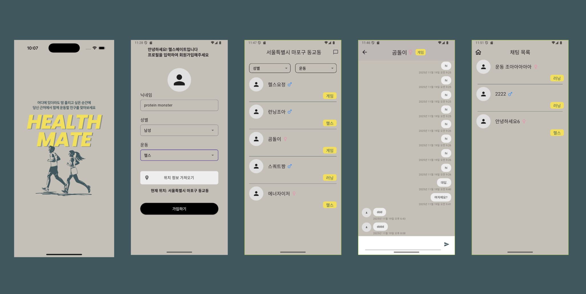

<h1 align="center">
HEALTH MATE
</h1>

  

 

## 🔖 프로젝트 개요
### “HEALTH MATE" 는 운동 메이트를 찾는 위치 기반 채팅앱 입니다.

#### HEALTH 는 다음과 같은 분들을 위해 탄생되었습니다.

> 장소에 상관없이 어디서든 운동하고 싶은 분들
> 

> 함께 운동할 새로운 친구를 찾고 있는 분들
> 

> 쉽고 빠르게 내 주변 운동 메이트를 검색하고 대화하고 싶은 분들
> 

      

## 🎨 앱 디자인 설계

  

 

## 📌 주요 기능
1. 닉네임, 성별, 운동을 지정해 프로필 생성
2. 현재 위치 정보를 가져오고 위치 정보와 일치하는 유저 목록 확인
3. 성별 및 운동 조건에 따라 유저 목록 필터링
4. 선택한 유저와 1:1 채팅
5. 현재 채팅중인 유저 목록 확인

 

## ⚙️ 프로젝트 개발

### 역할 분담
- 김시윤 : 프로필 페이지
- 박수진(팀장👑) : 채팅 페이지
- 안혜린 : 메인 목록 페이지
- 장준혁 : 채팅 목록 페이지

### 프로젝트 일정
25/11/13 ~ 25/11/20

### Technologies & Tools
     

### 라이브러리
dependencies: 
  flutter: 
    sdk: flutter 
 
  firebase_core: ^4.1.0 
  cloud_firestore: ^6.0.1 
  google_sign_in: ^6.0.0 
  firebase_auth: ^6.0.2 
 
  shared_preferences: ^2.2.3 
  uuid: ^4.4.0 
 
  flutter_riverpod: ^3.0.3 
  hooks_riverpod: ^3.0.3 
  riverpod_annotation: ^3.0.3 
 
  cupertino_icons: ^1.0.8 
  freezed: ^3.2.3 
  freezed_annotation: ^3.1.0 
  flutter_hooks: ^0.21.3+1 
  intl: ^0.20.2 
  dio: ^5.9.0 
  geolocator: ^14.0.2 
 
dev_dependencies: 
  flutter_test: 
    sdk: flutter 
  flutter_lints: ^5.0.0 
  build_runner: ^2.7.1 
  json_serializable: ^6.11.1 
  riverpod_generator: ^3.0.3 

 

## 📂 프로젝트 구조
<pre>
lib/
 ㄴ core
     ㄴ app_theme                         : 앱 내 테마 적용
     ㄴ device_id                         : 내 디바이스 아이디 가져오기
     ㄴ firebase_options                  : firebase 프로젝트와 앱을 연결하는 설정 정보
     ㄴ geolocator_helper                 : geolocator 패키지 사용을 위한 위치 권한 상태 확인
 ㄴ data/
     ㄴ model/
         ㄴ chat_messages                 : 채팅 메세지 데이터 모델
         ㄴ chat_room                     : 채팅방 데이터 모델
         ㄴ profile                       : 유저 데이터 모델
     ㄴ repository/
         ㄴ chat_conversation_repository  : 특정 채팅방의 메시지 실시간 구독하기
         ㄴ chat_detail_repository        : roomId로 ChatRoom 정보 가져오기
         ㄴ chat_list_repository          : deviceId를 기준으로 내가 속한 채팅방 목록 조회하기
         ㄴ chat_room_repository          : 새로운 Chatroom 및 roomId 생성하기
         ㄴ profile_core_repository       : 새로운 profile 생성
         ㄴ profile_repository            : deviceId를 기준으로 내 profile 가져오기, 특정 full_nm 값과 같은 profile 리스트만 조회하기
         ㄴ vworld_repository             : 위도와 경도를 기준으로 읍면동 정보 가져오기
 ㄴ ui/
     ㄴ chat_page/                        : 채팅 페이지
         ㄴ view/
             ㄴ chat_page_view          
         ㄴ view_model/
             ㄴ chat_conversation_view_model
             ㄴ chat_page_view_model
         ㄴ widgets/
             ㄴ chat_detail_app_bar
             ㄴ chat_detail_bottom_sheet
             ㄴ chat_detail_list_view
             ㄴ chat_detail_receive_item
             ㄴ chat_detail_send_item
     ㄴ chatlist_page/                    : 채팅 목록 페이지
         ㄴ view/
             ㄴ chat_list_view
         ㄴ view_model/
             ㄴ chat_list_view_model
     ㄴ mainlist_page/                    : 메인 목록 페이지
         ㄴ view/
             ㄴ mainlist_page_view
         ㄴ view_model
             ㄴ mainlist_page_view_model
         ㄴ widgets/
             ㄴ filtering_dropdown_box
     ㄴ profile_page/                     : 프로필 페이지
         ㄴ view/
             ㄴ location_page
             ㄴ profile_page_view
         ㄴ view_model
             ㄴ address_seatch_view_model
         ㄴ widgets/
             ㄴ form_field_row
     ㄴ root_page                         : 생성한 프로필이 firebase에 이미 존재하는지 확인 후 페이지를 이동시키는 페이지
     ㄴ splash_page                       : 앱 실행 시 가장 먼저 보이는 스플레시 페이지
 ㄴ widgets/ 
     ㄴ icons/
         ㄴ female_icon
         ㄴ male_icon
     ㄴ imagebox
     ㄴ profile_box
 ㄴ main                                  : 메인 실행 파일
assets/images/                           : 앱 내에서 사용된 이미지 파일
README.md                                : 프로젝트 설명 문서
</pre>

 

## 📝 커밋 컨벤션

- feat: 새로운 기능 추가
- fix: 버그 수정
- docs: 문서 수정
- style: 코드 포맷팅, 세미콜론 누락 등
- refactor: 코드 리팩터링
- test: 테스트 코드 추가
- chore: 빌드, 패키지 매니저 등 환경 설정
