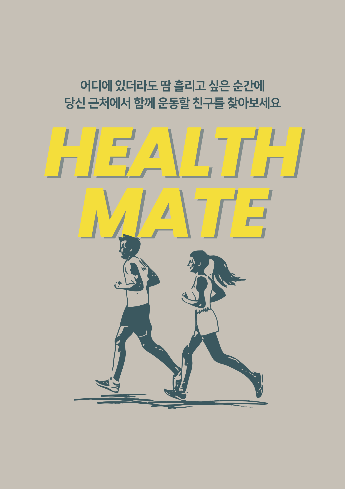

<h1 align="center">
HEALTH MATE
</h1>

  

 

## 🔖 프로젝트 개요
### “HEALTH MATE" 는 운동 메이트를 찾는 위치 기반 채팅앱 입니다.

#### HEALTH 는 다음과 같은 분들을 위해 탄생되었습니다.

> 장소에 상관없이 어디서든 운동하고 싶은 분들
> 

> 함께 운동할 새로운 친구를 찾고 있는 분들
> 

> 쉽고 빠르게 내 주변 운동 메이트를 검색하고 대화하고 싶은 분들
> 

      

## 🎨 앱 디자인 설계

  

 

## 📌 주요 기능
1. 닉네임, 성별, 운동을 지정해 프로필 생성
2. 현재 위치 정보를 가져오고 위치 정보와 일치하는 유저 목록 확인
3. 성별 및 운동 조건에 따라 유저 목록 필터링
4. 선택한 유저와 1:1 채팅
5. 현재 채팅중인 유저 목록 확인

 

## 프로젝트 개발

### 역할 분담
| **김시윤** | 프로필 페이지, GPS 연동
| :------: |
| **박수진** | 팀장 👑 채팅 페이지, Firebase 연동
| :------: |
| **안혜린** | 메인 목록 페이지
| :------: |
| **장준혁** | 채팅 목록 페이지
| :------: |

### 프로젝트 일정
25/11/13 ~ 25/11/20

### Technologies & Tools
     

 

## TroubleShooting

#### 제목
- **배경** : 
- **발단** : 
- **전개** : 
- **위기** : 
- **절정** : 
- **결말** : 

## 📂 프로젝트 구조
<pre>
lib/
 ㄴ main          : 메인 실행 파일
 ㄴ theme         : 앱 전체의 테마 지정
 ㄴ data/
     ㄴ model/
     ㄴ repository/
 ㄴ ui/
     ㄴ chat_page/
     ㄴ chatlist_page/
     ㄴ mainlist_page/
     ㄴ profile_page/
 ㄴ utils/
 ㄴ widgets/
assets/images/   : 앱 내에서 사용된 이미지 파일
README.md        : 프로젝트 설명 문서
</pre>

 

## 📝 커밋 컨벤션

- feat: 새로운 기능 추가
- fix: 버그 수정
- docs: 문서 수정
- style: 코드 포맷팅, 세미콜론 누락 등
- refactor: 코드 리팩터링
- test: 테스트 코드 추가
- chore: 빌드, 패키지 매니저 등 환경 설정